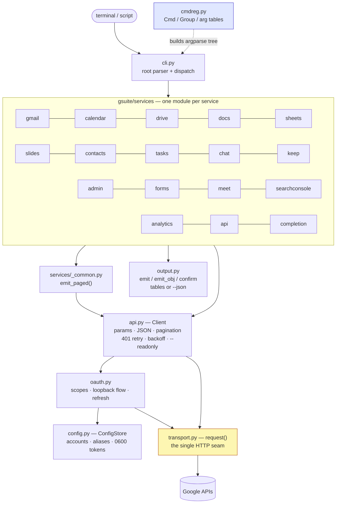
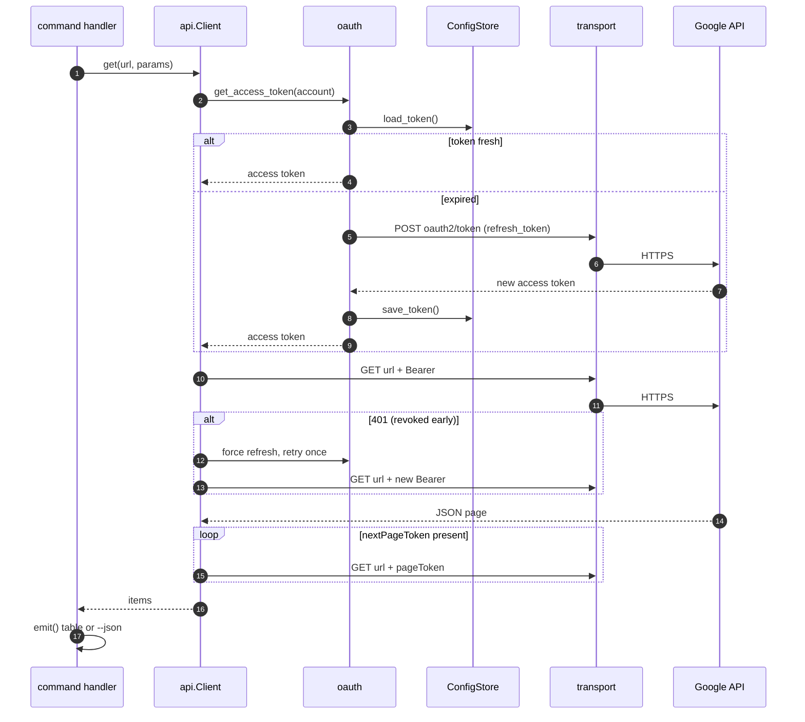

# Architecture

`gsuite` is a thin, layered CLI: a declarative command registry on top, one
authorized HTTP client in the middle, and a single network seam at the
bottom. No runtime dependencies — everything is Python standard library.

## Layer map



Two design rules fall out of this picture:

1. **One network seam.** Every byte to Google goes through
   `transport.request()`. Tests monkeypatch that one function with a
   programmable fake, so the whole suite runs offline.
2. **Commands are data.** Service modules declare their surface as
   `Cmd`/`Group` tables (`cmdreg.py`); the same tables drive `--help` *and*
   the generated [command reference](reference/index.md).

## Request lifecycle (with self-healing auth)



## Login flow (the UX this tool exists for)

```mermaid
sequenceDiagram
    autonumber
    actor U as user
    participant A as gsuite auth login
    participant L as loopback server<br/>127.0.0.1:&lt;random&gt;
    participant B as browser
    participant G as Google OAuth

    U->>A: gsuite auth login
    A->>L: bind random port, generate state
    A->>B: open consent URL
    B->>G: user approves scopes
    G->>L: redirect ?code=…&state=…
    L-->>A: code (state verified)
    A->>G: exchange code for tokens
    G-->>A: access + refresh token
    A->>G: userinfo (auto-detect email)
    A->>A: store account + 0600 token file
    A-->>U: Logged in as you@example.com
```

## Module inventory

| Module | Responsibility |
| --- | --- |
| `gsuite/cli.py` | root parser, service registry, dispatch, exit codes |
| `gsuite/cmdreg.py` | declarative `Cmd`/`Group`/`arg` → argparse tree |
| `gsuite/config.py` | `~/.config/gsuite`: accounts, aliases, tokens, client |
| `gsuite/oauth.py` | scope registry, loopback flow, code exchange, refresh |
| `gsuite/api.py` | `Client`: auth header, JSON, pagination, 401 retry, 429/5xx backoff, `--readonly` guard |
| `gsuite/transport.py` | `request()` — the only code that opens a socket |
| `gsuite/output.py` | `emit` (tables/JSON), `emit_obj`, `confirm` |
| `gsuite/services/_common.py` | `emit_paged()` — the list-command idiom |
| `gsuite/services/<name>.py` | one per service: handlers + command table |
| `gsuite/services/completion.py` | shell completion emitted from the parser tree |
| `gsuite/errors.py` | `CLIError` → exit 1; `AuthError`, `APIError` subclasses |

## On-disk state

```text
~/.config/gsuite/            (override with $GSUITE_CONFIG_DIR)
├── accounts.json            accounts, aliases, default account
├── client.json              OAuth client id/secret (Desktop app)
└── tokens/
    └── you@example.com.json access + refresh token, mode 0600
```
