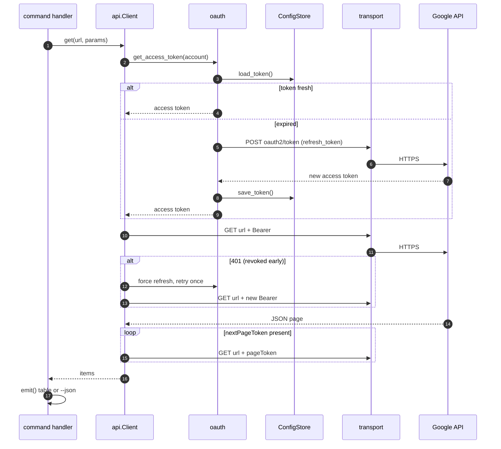

# Architecture

`gsuite` is a thin, layered CLI: a declarative command registry on top, one
authorized HTTP client in the middle, and a single network seam at the
bottom. No runtime dependencies — everything is Python standard library.

## Layer map


Two design rules fall out of this picture:

1. **One network seam.** Every byte to Google goes through
   `transport.request()`. Tests monkeypatch that one function with a
   programmable fake, so the whole suite runs offline.
2. **Commands are data.** Service modules declare their surface as
   `Cmd`/`Group` tables (`cmdreg.py`); the same tables drive `--help` *and*
   the generated [command reference](reference/index.md).

## Request lifecycle (with self-healing auth)



## Login flow (the UX this tool exists for)

```mermaid
sequenceDiagram
    autonumber
    actor U as user
    participant A as gsuite auth login
    participant L as loopback server<br/>127.0.0.1:&lt;random&gt;
    participant B as browser
    participant G as Google OAuth

    U->>A: gsuite auth login
    A->>L: bind random port, generate state
    A->>B: open consent URL
    B->>G: user approves scopes
    G->>L: redirect ?code=…&state=…
    L-->>A: code (state verified)
    A->>G: exchange code for tokens
    G-->>A: access + refresh token
    A->>G: userinfo (auto-detect email)
    A->>A: store account + 0600 token file
    A-->>U: Logged in as you@example.com
```

## Module inventory

| Module | Responsibility |
| --- | --- |
| `gsuite/cli.py` | root parser, service registry, dispatch, exit codes |
| `gsuite/cmdreg.py` | declarative `Cmd`/`Group`/`arg` → argparse tree |
| `gsuite/config.py` | config dir (`~/.config/gsuite` by default): accounts, aliases, tokens, client |
| `gsuite/oauth.py` | scope registry, loopback flow, code exchange, refresh |
| `gsuite/api.py` | `Client`: auth header, JSON, pagination, 401 retry, 429/5xx backoff, `--readonly` guard |
| `gsuite/transport.py` | `request()` — the only code that opens a socket |
| `gsuite/output.py` | `emit` (tables/JSON), `emit_obj`, `confirm` |
| `gsuite/services/_common.py` | `emit_paged()` — the list-command idiom |
| `gsuite/services/<name>.py` | one per service: handlers + command table |
| `gsuite/services/completion.py` | shell completion emitted from the parser tree |
| `gsuite/errors.py` | `CLIError` → exit 1; `AuthError`, `APIError` subclasses |

## On-disk state

The config directory is resolved in this order, first match wins (an env var
set to the empty string counts as unset):

| # | Condition | Directory |
| --- | --- | --- |
| 1 | `$GSUITE_CONFIG_DIR` set | that path, verbatim |
| 2 | Windows (`os.name == "nt"`) | `%APPDATA%\gsuite`, else `~/.gsuite` |
| 3 | `$XDG_CONFIG_HOME` set | `$XDG_CONFIG_HOME/gsuite` |
| 4 | otherwise | `~/.config/gsuite` |

```text
~/.config/gsuite/            (the default; see the resolution order above)  0700
├── accounts.json            accounts, aliases, default account             0600
├── client.json              OAuth client id/secret (Desktop app)           0600
└── tokens/                                                                 0700
    └── you@example.com.json access + refresh token                         0600
```

Every one of those files holds a credential, so `gsuite/config.py` writes them
all the same way (`_ensure_private_dir()` + `_write_atomic()`):

- **Directories are 0700, files are 0600.** Directories gsuite creates itself
  are chmod-ed after `mkdir` (the umask masks `mkdir(mode=...)`, so the mode is
  otherwise not deterministic); a pre-existing `$GSUITE_CONFIG_DIR` or parent is
  left as found, since it may be shared with other tools. Files are *created*
  0600 by `tempfile.mkstemp` rather than written and tightened afterwards —
  a chmod after the fact leaves a window in which the refresh token is on disk
  at the process umask, world-readable on a stock box. The explicit chmod stays,
  to tighten a file an older version left loose.
- **Writes are atomic.** The payload is staged in a temp file in the destination
  directory and published with `os.replace()` (an atomic rename on POSIX and
  Windows), so an interrupted run leaves either the old file or the new one —
  never a truncated `accounts.json` that no later command can parse. Should one
  turn up anyway (a hand-edit, a bad restore), reading it raises `CLIError`
  naming the file, not a `JSONDecodeError` traceback.
- **Text is UTF-8**, explicitly, on every read and write: JSON is UTF-8 by spec,
  while `read_text()`/`write_text()` would otherwise use the platform encoding
  and mangle non-ASCII account names on a Western Windows box (cp1252).
