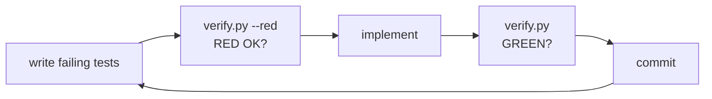

# Development

The project is built strictly **red-green**, one increment per commit, on a
single branch. `pytest` is the only dev dependency; the docs tooling
(`mkdocs-material`) is optional.

## The verification gate

One deterministic script runs everything, with terse stable output:

```console
$ python3 scripts/verify.py
GREEN: 254 passed in 6.3s

$ python3 scripts/verify.py --red     # run BEFORE implementing
RED OK: 4 failed, 250 passed in 6.4s
```

The gate is: byte-compile all sources → full test suite → generated-docs
sync check (`scripts/gen_docs.py --check`, covering both `docs/reference/`
and the README's command table). `--red` inverts the exit code:
it succeeds only if the suite *fails*, proving that freshly written tests
actually test something. The loop for every change:



CI (`.github/workflows/ci.yml`) runs this exact script — not a parallel
test configuration — on every push, across Python 3.10–3.13.

## Four gates, four kinds of confidence

`verify.py` is the fast one and covers almost everything. But every test it
runs drives `main()` in-process with the transport faked, which is blind to
whatever only breaks in a real process — packaging, entry points, pipe
behavior, the assembled request path. So there is a second script:

```console
$ python3 scripts/smoke.py
SMOKE OK: 31 checks passed
```

It installs the project into a throwaway virtualenv and drives the real
`gsuite` console script: every service's help, exit codes, closed-pipe
behavior, `bash -n` on the emitted completion script, and — via a loopback
HTTP server and `api call`'s full-URL form — genuine request round-trips.
Still no network: `HOME`, `GSUITE_CONFIG_DIR` and the ADC path are all
sandboxed so your own credentials cannot influence the result. CI runs it as
a second job.

The third generalises rather than adds cases. Six times now a command has
answered ordinary input with a Python traceback — a closed pipe, a DNS
failure, a non-JSON reply, a corrupt config file, an odd line separator in a
mail header, a missing `--attach` file — and every one was found by hand,
after the fact. What they share is not a subsystem but a property that
should hold for all 148 commands at once: *whatever the user types, they get
a message and an exit code.* That is what the fuzzer checks.

```console
$ python3 scripts/fuzz_cli.py
FUZZ OK: 5960 cases, no tracebacks

$ python3 scripts/fuzz_cli.py -v      # name each case as it runs
```

It walks the real parser tree, synthesises an invocation for every leaf
command filling each argument with one of ten fixed hostile values
(traversal, URL punctuation, embedded newlines, empty, wide/emoji, a path
that does not exist), and runs each against four canned replies including a
200 whose body is not JSON. No randomness and no seed: the same 5960 cases
in the same order every run, so a failure is reproducible from its printed
argv alone. It is offline — `transport.request` is stubbed and the OAuth
loopback never binds a port — and takes about 75 seconds. CI runs it as a
third job.

Its first run found three live bugs that 500 tests had not: `agenda --date
tomorrow`, `sheets rm-tab --tab Sheet1`, and any command at all when a proxy
answers `200 text/html` instead of Google.

A fuzzer that reports a defect in its own harness is worse than none, so
note the shape of the capture in `run_case`: stdout is a `TextIOWrapper`
over a `BytesIO`, not a `StringIO`, because `drive download` writes through
`sys.stdout.buffer` and a `StringIO` has none. The first version reported
that AttributeError as a finding — a bug no user could ever hit.

The fourth checks a claim rather than a behaviour. This project exists to
combine the command surfaces of `gws` and `gog`, and a coverage claim that
nothing measures is one that quietly stops being true.

```console
$ python3 scripts/parity.py --check
gws: 10 covered, 5 out of scope, 9 missing of 24
gog: 97 covered, 41 out of scope, 448 missing of 586
PARITY OK: no coverage regression
```

Two files keep the two kinds of knowledge apart. `parity/upstream.tsv` is
evidence: both projects' own published command lists, stamped with the URL,
the date and a digest of what was read, so any row can be re-derived.
`parity/mapping.tsv` is judgment: which upstream commands this tool provides
under a different name, and which it deliberately will not, each with a
reason someone can argue with. `--refresh` is the only part that touches the
network, and CI never runs it.

The ratchet fails on *regression*, not on absence. 448 gog commands are
missing and a gate that is red from day one is a gate people learn to skip,
so missing is the roadmap — `scripts/parity.py --missing gog` prints it —
while a drop in the covered count is the alarm.

Two properties of the gate itself are worth knowing, because both were bugs
first. An `alias` row is only counted once its target is confirmed to exist
in the parser, so deleting a command cannot hide behind a mapping that still
names it. And `--check` never writes: it shares its drift detection with the
README writer, so an earlier version repaired the drift on the way past and
the second run disagreed with the first.

`tests/test_integration.py` covers the same request path inside the fast
gate, running the CLI as a subprocess against a loopback server. That is
where the bearer header, real HTTP errors, 429 retry, `--debug` tracing and
the `--readonly` guard are pinned against actual sockets.

## Tests never touch the network

All HTTP funnels through `gsuite/transport.py:request()`. The
`fake_transport` fixture (in `tests/conftest.py`) replaces it with a
programmable fake — routes are one-shot and FIFO, so ordered sequences like
*401 → refresh → 200* are expressible:

```python
def test_drive_ls(authed, fake_transport, run_cli):
    fake_transport.add("GET", "drive/v3/files", {"files": [FILE_ROW]})
    out = run_cli("drive", "ls")
    assert "notes.txt" in out
```

`authed` pre-seeds a config store (in a temp dir via `GSUITE_CONFIG_DIR`)
with a logged-in account and fresh token; `run_cli` invokes `main()` and
asserts the exit code.

## Adding a service

1. **Tests first** — `tests/test_<name>.py` with `fake_transport` routes;
   run `python3 scripts/verify.py --red`.
2. **Module** — `gsuite/services/<name>.py`: handlers plus a declarative
   command table:

    ```python
    from gsuite.cmdreg import Cmd, arg, max_flag, register_service
    from gsuite.services._common import emit_paged

    BASE = "https://example.googleapis.com/v1"

    def cmd_list(args):
        emit_paged(args, f"{BASE}/things", [("ID", "id"), ("NAME", "name")],
                   limit=args.max)
        return 0

    def register(subparsers):
        register_service(subparsers, "example", "things: list", [
            Cmd("list", cmd_list, "list things", (max_flag(50),)),
        ])
    ```

3. **Wire it** — append the module name to `SERVICE_MODULES` in
   `gsuite/cli.py`, and add scopes to `SERVICE_SCOPES` in `gsuite/oauth.py`.
4. **Document it** — add an `EXAMPLES` entry in `scripts/gen_docs.py`, run
   `python3 scripts/gen_docs.py`, and add the page to `mkdocs.yml` nav.
   (Skipping any of this fails the gate: missing examples abort the
   generator, and the registry/docs tests pin the service list.)
5. `python3 scripts/verify.py` → green → commit.

## Documentation set

```text
mkdocs.yml            MkDocs Material config (mermaid enabled)
docs/
├── index.md          overview + quickstart
├── architecture.md   layer map & sequence diagrams (mermaid)
├── guides/           authentication, scripting & automation
├── reference/        GENERATED — one page per service (gen_docs.py)
└── development.md    this page
```

- `python3 scripts/gen_docs.py` regenerates `docs/reference/` from the live
  argparse tree — usage lines, option tables, and curated examples — plus the
  README's command table (between its `GENERATED COMMAND SUMMARY` markers).
  Never edit those by hand; the gate fails when they drift.
- Preview the site with `pip install mkdocs-material && mkdocs serve`.
  GitHub also renders every page (including mermaid) directly.

## Commit style

Conventional prefixes (`feat:`, `fix:`, `refactor:`, `docs:`), one red-green
increment per commit, always on the single main branch.
