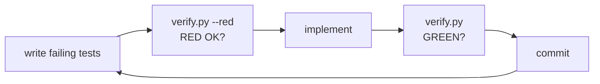

# Development

The project is built strictly **red-green**, one increment per commit, on a
single branch. `pytest` is the only dev dependency; the docs tooling
(`mkdocs-material`) is optional.

## The verification gate

One deterministic script runs everything, with terse stable output:

```console
$ python3 scripts/verify.py
GREEN: 254 passed in 6.3s

$ python3 scripts/verify.py --red     # run BEFORE implementing
RED OK: 4 failed, 250 passed in 6.4s
```

The gate is: byte-compile all sources → full test suite → generated-docs
sync check (`scripts/gen_docs.py --check`, covering both `docs/reference/`
and the README's command table). `--red` inverts the exit code:
it succeeds only if the suite *fails*, proving that freshly written tests
actually test something. The loop for every change:



CI (`.github/workflows/ci.yml`) runs this exact script — not a parallel
test configuration — on every push, across Python 3.10–3.13.

## Tests never touch the network

All HTTP funnels through `gsuite/transport.py:request()`. The
`fake_transport` fixture (in `tests/conftest.py`) replaces it with a
programmable fake — routes are one-shot and FIFO, so ordered sequences like
*401 → refresh → 200* are expressible:

```python
def test_drive_ls(authed, fake_transport, run_cli):
    fake_transport.add("GET", "drive/v3/files", {"files": [FILE_ROW]})
    out = run_cli("drive", "ls")
    assert "notes.txt" in out
```

`authed` pre-seeds a config store (in a temp dir via `GSUITE_CONFIG_DIR`)
with a logged-in account and fresh token; `run_cli` invokes `main()` and
asserts the exit code.

## Adding a service

1. **Tests first** — `tests/test_<name>.py` with `fake_transport` routes;
   run `python3 scripts/verify.py --red`.
2. **Module** — `gsuite/services/<name>.py`: handlers plus a declarative
   command table:

    ```python
    from gsuite.cmdreg import Cmd, arg, max_flag, register_service
    from gsuite.services._common import emit_paged

    BASE = "https://example.googleapis.com/v1"

    def cmd_list(args):
        emit_paged(args, f"{BASE}/things", [("ID", "id"), ("NAME", "name")],
                   limit=args.max)
        return 0

    def register(subparsers):
        register_service(subparsers, "example", "things: list", [
            Cmd("list", cmd_list, "list things", (max_flag(50),)),
        ])
    ```

3. **Wire it** — append the module name to `SERVICE_MODULES` in
   `gsuite/cli.py`, and add scopes to `SERVICE_SCOPES` in `gsuite/oauth.py`.
4. **Document it** — add an `EXAMPLES` entry in `scripts/gen_docs.py`, run
   `python3 scripts/gen_docs.py`, and add the page to `mkdocs.yml` nav.
   (Skipping any of this fails the gate: missing examples abort the
   generator, and the registry/docs tests pin the service list.)
5. `python3 scripts/verify.py` → green → commit.

## Documentation set

```text
mkdocs.yml            MkDocs Material config (mermaid enabled)
docs/
├── index.md          overview + quickstart
├── architecture.md   layer map & sequence diagrams (mermaid)
├── guides/           authentication, scripting & automation
├── reference/        GENERATED — one page per service (gen_docs.py)
└── development.md    this page
```

- `python3 scripts/gen_docs.py` regenerates `docs/reference/` from the live
  argparse tree — usage lines, option tables, and curated examples — plus the
  README's command table (between its `GENERATED COMMAND SUMMARY` markers).
  Never edit those by hand; the gate fails when they drift.
- Preview the site with `pip install mkdocs-material && mkdocs serve`.
  GitHub also renders every page (including mermaid) directly.

## Commit style

Conventional prefixes (`feat:`, `fix:`, `refactor:`, `docs:`), one red-green
increment per commit, always on the single main branch.
